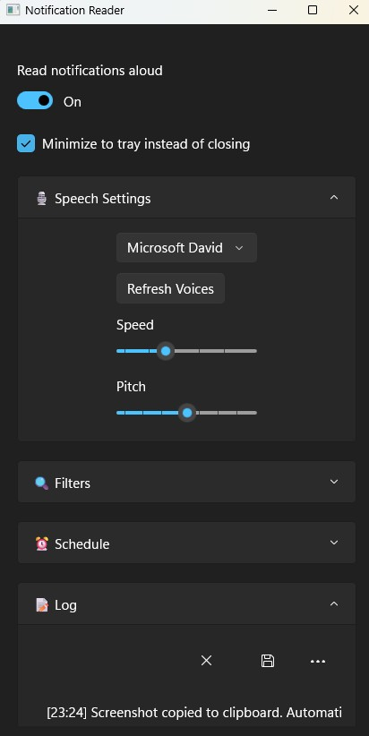

# NotificationReader-WinUIApp
NotificationReader is a lightweight desktop application designed to help you manage and review system notifications with ease. Built with WinUI 3 and the latest Windows App SDK, it offers a fast, fluid interface that integrates seamlessly with Windows 10 and 11.

# Image ShowCase

Key Features:

📌 Real-time Notification Capture – Instantly read and store system notifications as they arrive.

🔊 Speech Output – Listen to your notifications with built-in speech synthesis for hands-free awareness.

🖥️ Modern WinUI Interface – Enjoy a clean, responsive design that feels native to Windows.

🛠️ Tray Integration – Run in the background with a system tray presence, so you never miss an update.

🎛️ Custom Controls – Toggle background running, show/hide tray icon, and manage app behavior directly from the UI.

⚡ Optimized Performance – Lightweight and efficient, designed to minimize resource usage.

Why NotificationReader?  
Whether you’re multitasking, need accessibility support, or simply want a smarter way to keep track of notifications, NotificationReader ensures you stay informed without distractions.
