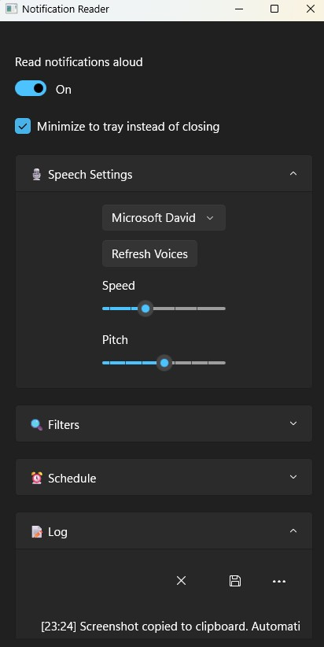
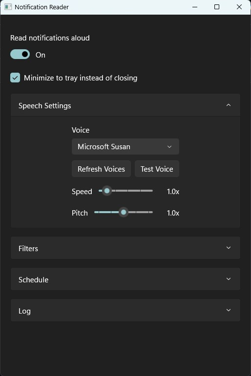
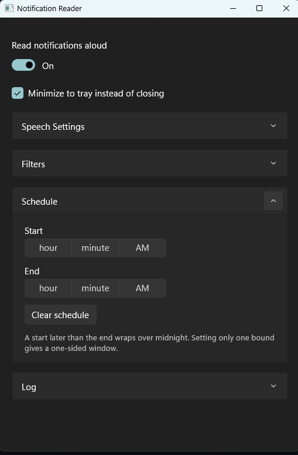
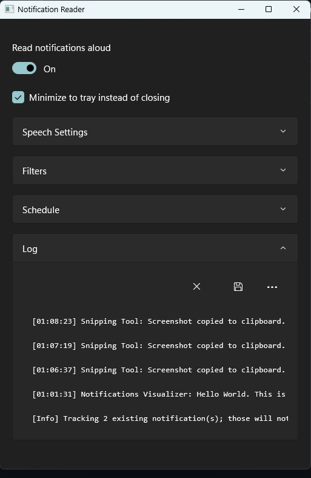

# NotificationReader

**NotificationReader** is a lightweight, modern desktop application built for Windows 10 and 11. It captures, organizes, and reads aloud incoming system notifications in real time—helping you stay informed without breaking your focus or workflow. Make sure to download the app from Release Page.

---

## 📸 Interface Showcase

  
  

  
<b>View Additional Screenshots</b>

   
  

    
    
  

---

## ✨ Key Features

* **📌 Real-Time Notification Capture:** Continuously monitors and logs Windows system notifications as they arrive.
* **🔊 Text-to-Speech (TTS):** Native speech synthesis reads notifications out loud for complete hands-free awareness.
* **🖥️ Native WinUI 3 Design:** A sleek, responsive user interface built using Fluent Design principles to blend seamlessly into Windows 11.
* **🛠️ System Tray Integration:** Runs silently in the background without cluttering your taskbar.
* **🎛️ Granular Control:** Easily toggle background processing, adjust speech output, and customize tray behavior directly from settings.
* **⚡ Resource-Efficient:** Engineered for minimal CPU and RAM usage.

---

## 💡 Use Cases

* **Multitasking & Focus:** Stay updated on emails, messages, and alerts without interrupting full-screen apps or deep work.
* **Accessibility:** Enhances Windows usage for visually impaired users through automated voice callouts.
* **Notification Logging:** Keep a searchable history of transient toast notifications that you might otherwise miss.

---

## 🚀 Getting Started

### Prerequisites

* **Operating System:** Windows 10 (version 1809 or higher) or Windows 11
* **Runtime:** [Windows App SDK Runtime](https://learn.microsoft.com/windows/apps/windows-app-sdk/downloads)

### Installation

1. Download the latest release package from the **[Releases](../../releases)** section.
2. Unpack the `.zip` file into your desired directory.
3. Install certificate & Run `NotificationReader.exe`. 

---

## 🛠️ Tech Stack

* **UI Framework:** WinUI 3 (Windows App SDK)
* **Language:** C# / .NET
* **Platform APIs:** `Windows.UI.Notifications`, `Windows.Media.SpeechSynthesis`

---

## 🤝 Contributing

Contributions are welcome! If you'd like to improve NotificationReader:

1. Fork the project repository.
2. Create your feature branch (`git checkout -b feature/AmazingFeature`).
3. Commit your changes (`git commit -m 'Add some AmazingFeature'`).
4. Push to the branch (`git push origin feature/AmazingFeature`).
5. Open a Pull Request.

---

## 📄 License

Distributed under the MIT License. See `LICENSE` for more information.
